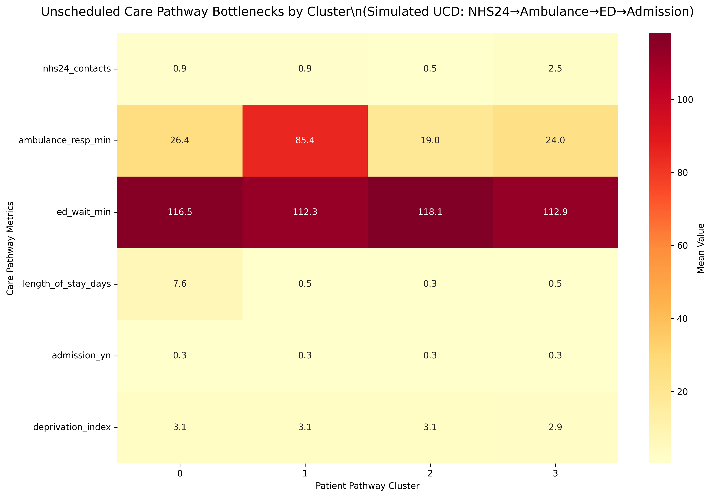

# ucd-patient-pathway-analysis
K-Means clustering for unscheduled care pathways 
# UCD Patient Pathway Clustering (AI4BI CDT Project 1)

**Live demonstration of K-Means analysis for unscheduled care bottlenecks**

## Results

**Interactive Colab**: 

**Key Methods**:
- K-Means (4 pathway clusters)
- UCD simulation (NHS24→ED→Admission)  
- Equity analysis (deprivation correlation)

Chanel Roberts | MSc Data Science for Health & Social Care | UoE
